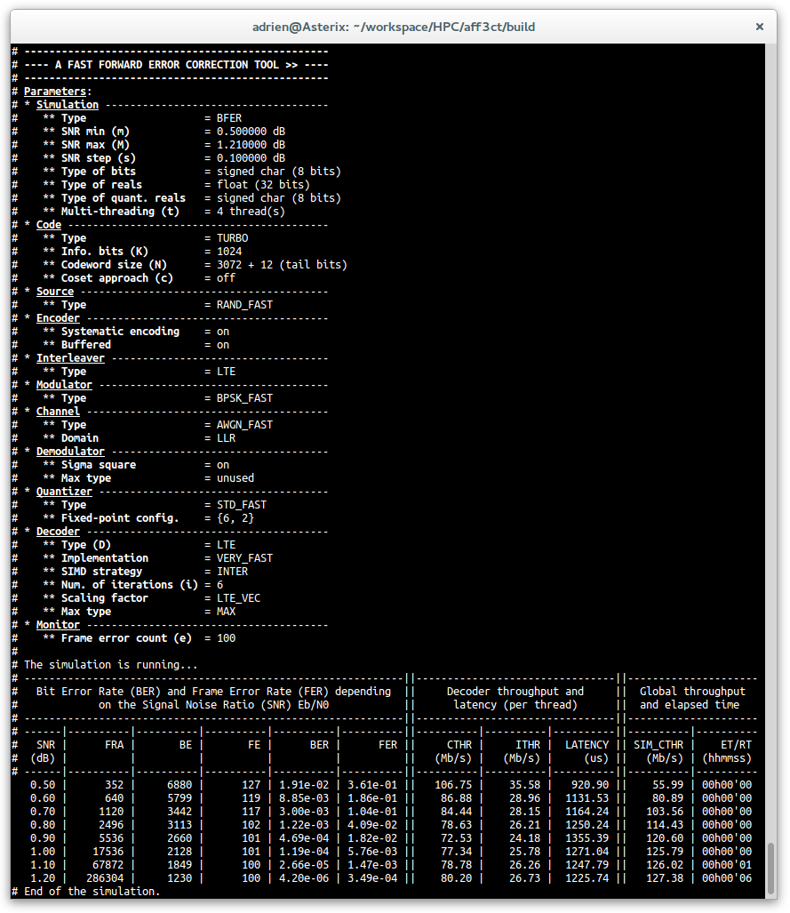

Welcome on the official AFF3CT documentation {#mainpage}
========================================================

**AFF3CT** is an **Open-source software** (*MIT license*) dedicated to the **Forward Error Correction (FEC or channel coding) simulations**. It is written in **C++11** and it supports a large range of codes: from the well-spread **Turbo codes** to the very new **Polar codes** including the **Low-Density Parity-Check (LDPC) codes**. A particular emphasis is given to **the simulation throughput performance** (hundreds of Mb/s on today's CPUs) and the portability of the code.

You can get the code source from the **GitHub repository**: [https://github.com/aff3ct/aff3ct](https://github.com/aff3ct/aff3ct).

**AFF3CT** works with many compilers (`g++`, `clang++`, `icpc`, `msvc++`) and on the most common operating systems (Linux, MacOS X and Windows).

## Structure and philosophy of the code

In **AFF3CT** it is all about Simulation and Module. A Simulation object links a set of Module objects together.
Here is the list of available type of Simulation:
- Simulation BER/FER (aff3ct::simulation::BFER_std): dedicated to the [Bit Error Rate](https://en.wikipedia.org/wiki/Bit_error_rate) (BER) and Frame Error Rate (FER) performances,
- Simulation BER/FER iterative (aff3ct::simulation::BFER_ite): dedicated to the BER/FER performances with turbo-demodulation between the demodulator and the decoder,
- Simulation EXIT Chart (aff3ct::simulation::EXIT): dedicated to the [EXtrinsic Information Transfer](https://en.wikipedia.org/wiki/EXIT_chart) (EXIT) chart.

	

Many Module objects can be used in a Simulation (aff3ct::simulation::Simulation):
- aff3ct::module::Source,
- aff3ct::module::CRC,
- aff3ct::module::Codec,
- aff3ct::module::Puncturer,
- aff3ct::module::Encoder,
- aff3ct::module::Decoder,
- aff3ct::module::Interleaver,
- aff3ct::module::Modem,
- aff3ct::module::Channel,
- aff3ct::module::Quantizer,
- aff3ct::module::Coset,
- aff3ct::module::Monitor.

## Related pages

1. [How to compile and run the code](md__home_adrien_workspace_HPC_aff3ct_README.html)
2. [How to visualize simulated data (PyBER)](md_pages_PyBER.html)
3. [Reproduce scientific results](md_pages_Paper_results.html)

------------------------------------------------------------------------------------------------------------------------

