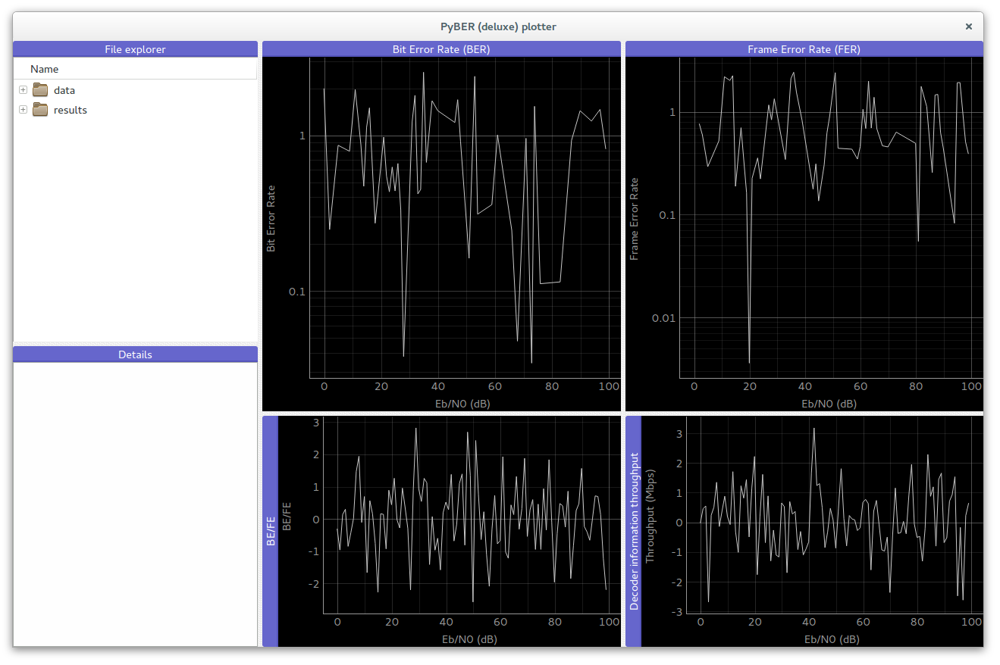

# How to visualize simulated data (PyBER)
**AFF3CT** comes with a *Bit/Frame Error Rate* (BER and FER) specific visualization tool: the **PyBER** plotter.
**PyBER** is written in *Python* and directly plots curves from the standard **AFF3CT** output.

## Install Python 3 and dependencies

First install *Python 3* and the Python 3 package manager *PIP*:

	$ sudo apt-get install python3 python3-pip

Next, install the required dependencies to run **PyBER**:

	$ sudo pip numpy pyqt5

## Run PyBER

From the https://github.com/aff3ct/PyBER repo root directory:

	$ python3 pyBER.py

By default, **PyBER** shows the folders and files located in the `tests` directory.
The program only shows the file with the following extensions:
- `*.txt`,
- `*.dat`,
- `*.data`,
- `*.perf`.

## Display existing simulations

The `tests/data` folder contains a set of simulations pre-ran with **AFF3CT**. You can select the corresponding files in the `data` folder and take a look on the decoding performances.
You can display more than one curve at a time by selecting a set of files (keep the `ctrl` or `maj` key pressed and select the files you want to compare with the left mousse button).

## Run a new simulation and visualize the results

Lets assume that you have compiled **AFF3CT** and you are in the `build` directory. You can launch a new simulation and redirect the standard output in a file like this:

	$ ./bin/aff3ct --sim-type BFER --cde-type TURBO -K 1024 -N 3072 -m 0.0 -M 1.01 --dec-type LTE --dec-implem FAST -i 6 > ../tests/data/turbo_simu.txt

You have just created a new file (`../tests/data/turbo_simu.txt`) and you can visualize it.
Notice than **PyBER** is able to update the curves in real time (no user action is needed to refresh the selected file(s)).

