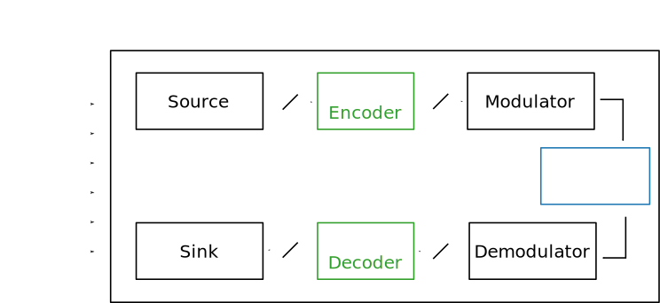
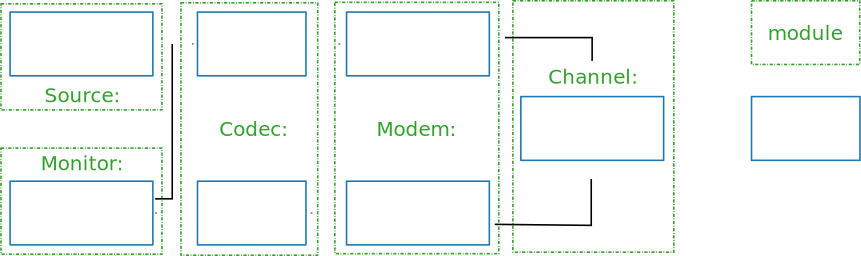

.. _user_simulation_overview:

Overview
--------

The |AFF3CT| toolbox comes with a simulator dedicated to the **communication
chains**. The simulator focuses on **the channel coding level**. It can be used
to reproduce/validate **state-of-the-art BER/FER performances** as well as an
**exploration tool to bench various configurations**.

.. _Monte Carlo method: https://en.wikipedia.org/wiki/Monte_Carlo_method

The |AFF3CT| simulator is based on a `Monte Carlo method`_: the transmitter
emits frames that are **randomly noised by the channel** and then the receiver
try to decode the noised frames. The transmitter continues to emit frames until
a fixed number of frame errors in achieved (typically 100 frame errors).
A frame error occurs when the original frame from the transmitter differs from
the the receiver decoded frame. As a consequence, when the |SNR| increases,
the number of frames to simulate increases as well as the simulation time.

Basic Arguments
"""""""""""""""

The |AFF3CT| simulator is a **command line program** which can take many
different arguments. The command line interface make possible to write scripts
that run a battery of simulations for instance. Here is a minimalist command
line using |AFF3CT|:

.. code-block:: bash

   aff3ct -C "POLAR" -K 1723 -N 2048 -m 1.0 -M 4.0 -s 1.0

``-C`` is a required parameter that defines the type of channel code that will
be used in the communication chain (see the :ref:`sim-sim-cde-type` section).
``-K`` is the number of information bits and ``-N`` is the frame size (bits
transmitted over the channel). The :numref:`fig_sim_code` illustrates those
parameters in a simplified communication chain.

.. _fig_sim_code:

   Code-related parameters in the communication chain.

The simulator computes the |BER| and the |FER| for a |SNR| range (by default the
|SNR| is :math:`E_b/N_0` in dB). ``-m`` is the first |SNR| value to simulate
with and ``-M`` is the last one (see the :ref:`sim-sim-noise-min` and
:ref:`sim-sim-noise-max` sections for more information). ``-s`` is the step
between each |SNR| (c.f. section :ref:`sim-sim-noise-step`). The
:numref:`fig_sim_snr` shows the output |BER| for each simulated |SNR| values.

.. _fig_sim_snr:

   |SNR|-related parameters in the communication chain.

.. _user_simulation_overview_output:

Output
""""""

The output of following command will look like:

.. code-block:: bash

	aff3ct -C "POLAR" -K 1723 -N 2048 -m 1.0 -M 4.0 -s 1.0
	# ----------------------------------------------------
	# ---- A FAST FORWARD ERROR CORRECTION TOOLBOX >> ----
	# ----------------------------------------------------
	# Parameters :
	# [...]
	#
	# The simulation is running...
	# ---------------------||------------------------------------------------------||---------------------
	#  Signal Noise Ratio  ||   Bit Error Rate (BER) and Frame Error Rate (FER)    ||  Global throughput
	#         (SNR)        ||                                                      ||  and elapsed time
	# ---------------------||------------------------------------------------------||---------------------
	# ----------|----------||----------|----------|----------|----------|----------||----------|----------
	#     Es/N0 |    Eb/N0 ||      FRA |       BE |       FE |      BER |      FER ||  SIM_THR |    ET/RT
	#      (dB) |     (dB) ||          |          |          |          |          ||   (Mb/s) | (hhmmss)
	# ----------|----------||----------|----------|----------|----------|----------||----------|----------
	       0.25 |     1.00 ||      104 |    16425 |      104 | 9.17e-02 | 1.00e+00 ||    4.995 | 00h00'00
	       1.25 |     2.00 ||      104 |    12285 |      104 | 6.86e-02 | 1.00e+00 ||   13.678 | 00h00'00
	       2.25 |     3.00 ||      147 |     5600 |      102 | 2.21e-02 | 6.94e-01 ||   14.301 | 00h00'00
	       3.25 |     4.00 ||     5055 |     2769 |      100 | 3.18e-04 | 1.98e-02 ||   30.382 | 00h00'00
	# End of the simulation.

All the line beginning by the ``#`` character are intended present the
simulation but there are not computational results. On the top, there is the
list of the simulation parameters (above the ``# Parameters :`` line). After
that, the simulation results are shown, each line corresponds to the decoding
performance considering a given |SNR|. Each line is composed by the following
columns:

* ``Es/N0``: the |SNR| expressed as :math:`E_s/N_0` in dB (c.f. the :ref:`sim-sim-noise-type` section),
* ``Eb/N0``: the |SNR| expressed as :math:`E_b/N_0` in dB (c.f. the :ref:`sim-sim-noise-type` section),
* ``FRA``: the number of simulated frames,
* ``BE``: the number of bit errors,
* ``FE``: the number of frame errors (see the :ref:`mnt-mnt-max-fe` section if you want to modify it),
* ``BER``: the bit error rate (:math:`BER = \frac{BE}{FRA \times K}`),
* ``FER``: the frame error rate (:math:`FER = \frac{FE}{FRA}`),
* ``SIM_THR``: the simulation throughput (:math:`SIM_{THR} = \frac{K \times FRA}{T}` where :math:`T` is the simulation time),
* ``ET/RT``: during the computation of the point, this column displays an estimation of the remaining time (``RT``), once the computations are done this is the total elapsed time (``ET``).

.. note:: You may notice slightly different values in |BER| and |FER| columns if
          you run the command line on your computer. This is because the
          simulation is **multi-threaded by default**: the order of threads
          execution is **not predictable**. If you want to have reproducible
          results you can launch |AFF3CT| in **mono-threaded mode** (see the
          :ref:`sim-sim-threads` section).

.. _user_simulation_overview_philosophy:

Philosophy
""""""""""

To understand the organization of the parameters in the simulator, it is
important to be aware of the simulator structure. As illustrated in the
:numref:`fig_sim_module_task`, a simulation contains a set of modules (`Source`,
`Codec`, `Modem`, `Channel` and `Monitor` in the example). A module can contain
one or more tasks. For instance, the `Source` module contains only one task:
`generate()`. In contrast, the `Modem` module contains two tasks: `modulate()`
and `demodulate()`. A task can be assimilated to a process which is executed at
runtime.

.. _fig_sim_module_task:

   Modules and tasks in the simulation.

Each module or task has its own set of arguments. Still, some of the
arguments are common to several modules and tasks:

- ``--xxx-type`` is often used to define the type of each module: the type of
  modulation, channel or channel decoder,

- ``--xxx-implem`` specifies the type of implementation used. The keywords
  ``NAIVE`` or ``STD`` are often used to denote a readable but unoptimized
  source code, whereas ``FAST`` stands for a source code that is optimized for a
  high throughput and/or low latency.
