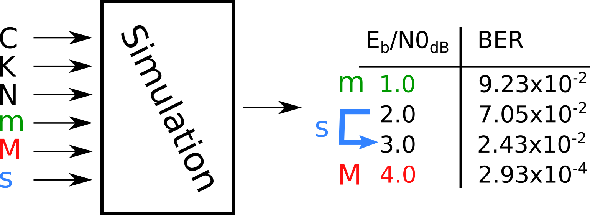
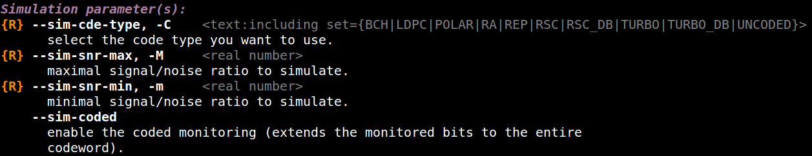
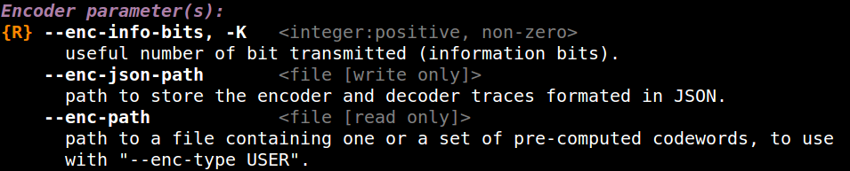
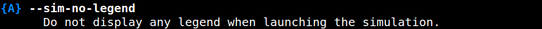
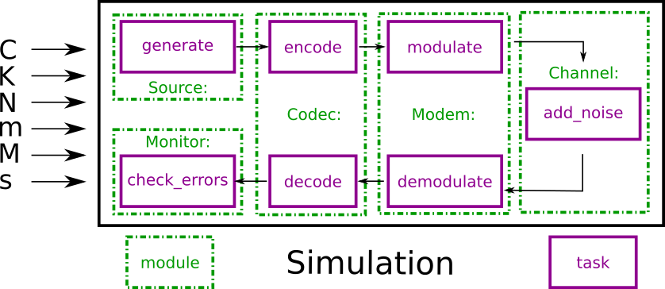

.. _simulation_overview:

Overview
--------

.. * describe the BER/FER simulator chains, and EXIT chart (add figures)
.. * detail the command line arguments philosophy:

..    - give a simple example and explain the main arguments (-C -N -K -m -M)
..    - explain the sub-arguments
..    - explain the redundant arguments (--type --implem --help --Help)

.. * tell that it is possible to use an `ini` file

The |AFF3CT| toolbox comes with a simulator dedicated to the **communication
chains**. The simulator focuses on **the channel coding level**. It can be used
to reproduce/validate **state-of-the-art BER/FER performances** as well as an
**exploration tool to bench various configurations**.

Basic Arguments
"""""""""""""""

The |AFF3CT| simulator is a **command line program** which can take many
different arguments. The command line interface make possible to write scripts
that run a battery of simulations for instance.

Here is a minimalist command line using |AFF3CT|:

.. code-block:: bash

   aff3ct -C POLAR -K 1723 -N 2048 -m 1.0 -M 4.0 -s 1.0

``-C`` is a required parameter that defines the type of channel code that will
be used in the communication chain (see the :ref:`sim-sim-cde-type` section for
more information). ``-K`` is the number of information bits and ``-N`` is the
frame size (bits transmitted over the channel). The :numref:`fig_sim_code`
illustrates those parameters in a simplified communication chain.

.. _fig_sim_code:

.. figure:: images/sim_code.png
   :figwidth: 70 %
   :align: center

   |SNR|-related parameters in the communication chain.

The simulator computes the |BER| and the |FER| for a |SNR| range (by default the
|SNR| is :math:`E_b/N_0` in dB). ``-m`` is the first |SNR| value to simulate
with and ``-M`` is the last one (see the :ref:`sim-sim-noise-min` and
:ref:`sim-sim-noise-max` sections for more information). ``-s`` is the step
between each |SNR| (c.f. section :ref:`sim-sim-noise-step`). The
:numref:`fig_sim_snr` shows the output |BER| for each simulated |SNR| values.

.. _fig_sim_snr:

   Noise-related parameters in the communication chain.

Surviving the Help
""""""""""""""""""

|AFF3CT| proposes a very complete help option with the ``-h`` flag:

.. code-block:: bash

   aff3ct -C POLAR -K 1723 -N 2048 -m 1.0 -M 4.0 -s 1.0 -h

.. _fig_arg_simulation:

   Simulation parameters.

.. _fig_arg_encoder:

   Encoder parameters.

:numref:`fig_arg_simulation` and :numref:`fig_arg_encoder` present samples of
the help output. The ``{R}`` tag denotes required argument for a given code and
simulation. Using the uppercase (``-H``) argument, advanced arguments are shown,
denoted with a ``{A}`` tag (c.f. :numref:`fig_arg_advanced`):

.. code-block:: bash

   aff3ct -C POLAR -K 1723 -N 2048 -m 1.0 -M 4.0 -s 1.0 -H

.. _fig_arg_advanced:

   Advanced simulation parameter.

Philosophy
""""""""""

To understand the organization of the parameters in the simulator, it is
important to be aware of the simulator structure. As illustrated in the
:numref:`fig_sim_module_task`, a simulation contains a set of modules (`Source`,
`Codec`, `Modem`, `Channel` and `Monitor` in the example). A module can contain
one or more tasks. For instance, the `Source` module contains only one task:
`generate()`. In contrast, the `Modem` module contains two tasks: `modulate()`
and `demodulate()`. A task can be assimilated to a process which is executed at
runtime.

.. _fig_sim_module_task:

   Modules and tasks of the communication chain.

Each module or task has its own set of arguments. Still, some of the
arguments are common to several modules and tasks:

- ``--xxx-type`` is often used to define the type of each module: the type of
  modulation, channel or channel decoder,

- ``--xxx-implem`` specifies the type of implementation used. The keywords
  ``NAIVE`` or ``STD`` are often used to denote a readable but unoptimized
  source code, whereas ``FAST`` stands for a source code that is optimized for a
  high throughput and/or low latency.