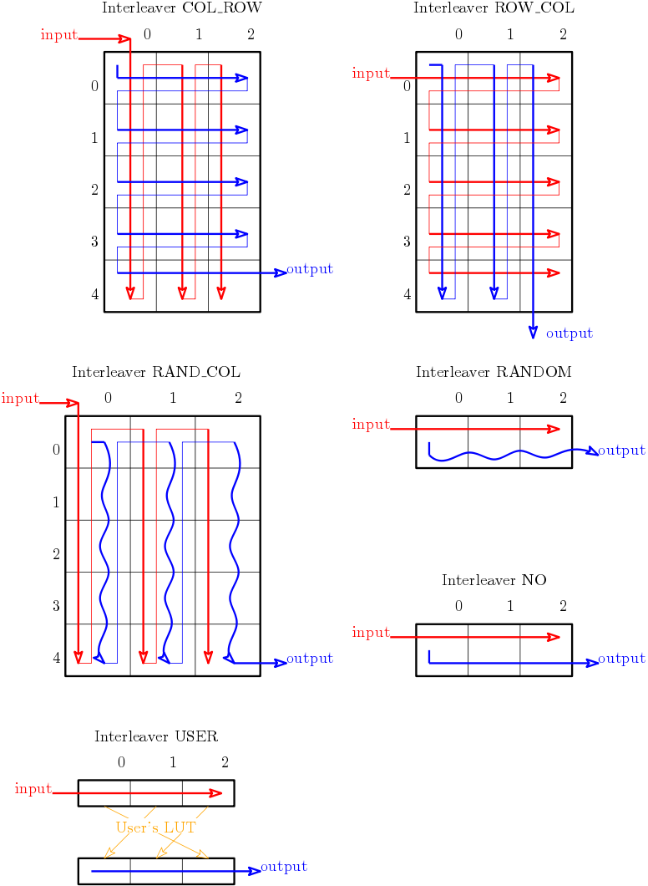
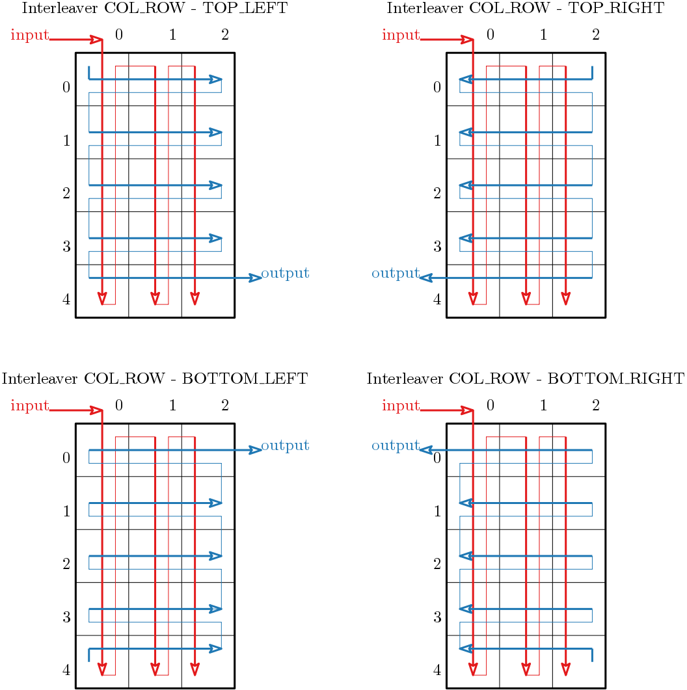

.. _itl-interleaver-parameters:

Interleaver parameters
----------------------

The interleaving process starts by the generation of the Look up Table (LUT).
This one describes for each bit of the output frame the position of the origin
of this bit inside the input frame. Thus, the interleaver simply fills the
output from the input according to this LUT.

The deinterleaving process reverses the LUT to find back the natural order of
the frame.

.. _itl-itl-type:

``--itl-type``
""""""""""""""

   :Type: text
   :Allowed values: ``CCSDS`` ``COL_ROW`` ``DVB-RCS1`` ``DVB-RCS2`` ``GOLDEN``
                    ``LTE`` ``NO`` ``RANDOM`` ``RAND_COL`` ``ROW_COL`` ``USER``
   :Default: ``RANDOM``
   :Examples: ``--itl-type RANDOM``

Type of the interleaver to use in the simulation.

Description of the allowed values:

+--------------+---------------------------+
| Value        | Description               |
+==============+===========================+
| ``CCSDS``    | |itl-type_descr_ccsds|    |
+--------------+---------------------------+
| ``COL_ROW``  | |itl-type_descr_col_row|  |
+--------------+---------------------------+
| ``DVB-RCS1`` | |itl-type_descr_dvb-rcs1| |
+--------------+---------------------------+
| ``DVB-RCS2`` | |itl-type_descr_dvb-rcs2| |
+--------------+---------------------------+
| ``GOLDEN``   | |itl-type_descr_golden|   |
+--------------+---------------------------+
| ``LTE``      | |itl-type_descr_lte|      |
+--------------+---------------------------+
| ``NO``       | |itl-type_descr_no|       |
+--------------+---------------------------+
| ``RANDOM``   | |itl-type_descr_random|   |
+--------------+---------------------------+
| ``RAND_COL`` | |itl-type_descr_rand_col| |
+--------------+---------------------------+
| ``ROW_COL``  | |itl-type_descr_row_col|  |
+--------------+---------------------------+
| ``USER``     | |itl-type_descr_user|     |
+--------------+---------------------------+

.. |itl-type_descr_ccsds|    replace:: Selects the interleaver defined for the
   CCSDS standard.
.. |itl-type_descr_col_row|  replace:: Fills the interleaver by column and reads
   it by row.
.. |itl-type_descr_dvb-rcs1| replace:: Selects the interleaver defined for the
   DVB-RCS1 standard.
.. |itl-type_descr_dvb-rcs2| replace:: Selects the interleaver defined for the
   DVB-RCS2 standard.
.. |itl-type_descr_golden|   replace:: TODO VALUE GOLDEN
.. |itl-type_descr_lte|      replace:: Selects the interleaver defined for the
   LTE standard.
.. |itl-type_descr_no|       replace:: Deactivates the interleaving process: the
   output is the input.
.. |itl-type_descr_random|   replace:: Generates a completely random LUT.
.. |itl-type_descr_rand_col| replace:: Randomly interleaves the frame by
   independent columns.
.. |itl-type_descr_row_col|  replace:: Fills the interleaver by row and read it
   by column.
.. |itl-type_descr_user|     replace:: Uses the user's LUT given in the file
   through :ref:`itl-itl-path`.

The figure :numref:`itl_figures_types` depicts the behavior of the interleaver
basic types.

.. _itl_figures_types:

   Interleaver basic types.

.. seealso:: The :ref:`itl-itl-read-order` argument allows more options for the
   ``COL_ROW`` and ``ROW_COL`` interleavers.

.. _itl-itl-cols:

``--itl-cols``
""""""""""""""

   :Type: integer
   :Default: 4
   :Examples: ``--itl-cols 1``

Specifies the number of columns used for the ``RAND_COL``, ``ROW_COL`` or
``COL_ROW`` interleavers.

.. _itl-itl-path:

``--itl-path``
""""""""""""""

   :Type: file
   :Rights: read only
   :Examples: ``--itl-path ../conf/itl/GSM-LDPC_4224.itl``

Specifies the path to the interleaver file (to use with ``USER`` interleaver).

.. _itl-itl-read-order:

``--itl-read-order``
""""""""""""""""""""

   :Type: text
   :Allowed values: ``BOTTOM_LEFT`` ``BOTTOM_RIGHT`` ``TOP_LEFT`` ``TOP_RIGHT``
   :Examples: ``--itl-read-order BOTTOM_LEFT``

The read order of the ``COL_ROW`` and ``ROW_COL`` interleavers.
The read starts from the given corner of the array to the diagonally opposite
one. The read is made row by row for the ``COL_ROW`` interleaver and column by
column for the ``ROW_COL`` one.

Description of the allowed values (see also the figures just bellow):

+------------------+-------------------------------------+
| Value            | Description                         |
+==================+=====================================+
| ``TOP_LEFT``     | |itl-read-order_descr_top_left|     |
+------------------+-------------------------------------+
| ``TOP_RIGHT``    | |itl-read-order_descr_top_right|    |
+------------------+-------------------------------------+
| ``BOTTOM_LEFT``  | |itl-read-order_descr_bottom_left|  |
+------------------+-------------------------------------+
| ``BOTTOM_RIGHT`` | |itl-read-order_descr_bottom_right| |
+------------------+-------------------------------------+

.. |itl-read-order_descr_top_left| replace:: Read is down from the top left
   corner to the bottom right corner
.. |itl-read-order_descr_top_right| replace:: Read is down from the top right
   corner to the bottom left corner
.. |itl-read-order_descr_bottom_left| replace:: Read is down from the bottom
   left corner to the top right corner
.. |itl-read-order_descr_bottom_right| replace:: Read is down from the bottom
   right corner to the top left corner

The figure :numref:`itl_figures_order_col_row` depicts the read order options on
the ``COL_ROW`` interleaver.

.. _itl_figures_order_col_row:

   Interleaver read order for ``COL_ROW`` type.

The figure :numref:`itl_figures_order_row_col` depicts the read order options on
the ``ROW_COL`` interleaver.

.. _itl_figures_order_row_col:

   Interleaver read order for ``COL_ROW`` type.

.. _itl-itl-uni:

``--itl-uni``
"""""""""""""

Enables the regeneration of the interleaver at *each new frame* else the LUT
is generated only once and is used all along the simulation.

