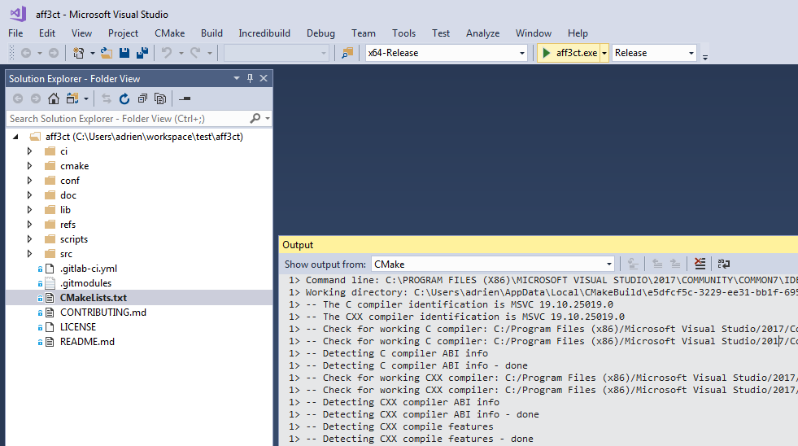
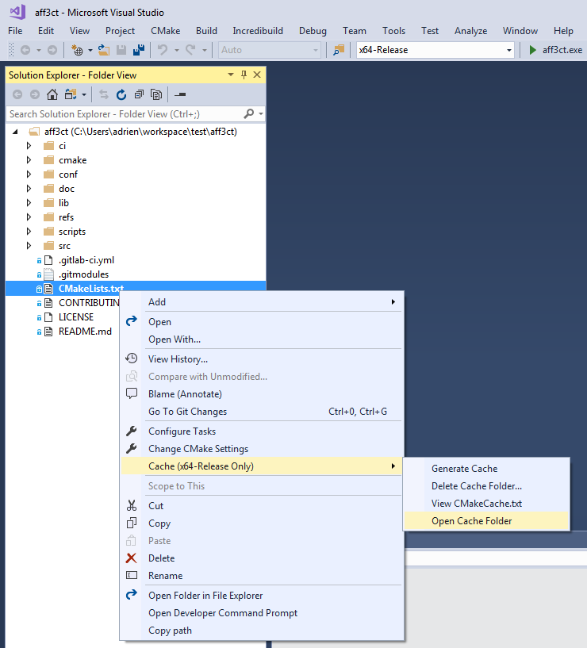

.. _user_installation_guide_compilation:

Compilation
===========

.. important:: If you do not plan to modify the |AFF3CT| source code and you
               want to use the simulator/library as is, you can **download one
               of the latest builds** from the
               `download page of the AFF3CT website <http://aff3ct.github.io/download.html>`_
               and skip this section.

.. _CMake: https://cmake.org/

This project uses `CMake`_ in order to generate any type of projects (Makefile,
Visual Studio, Eclipse, CLion, XCode, etc.).

|AFF3CT| is portable and can be compiled on Windows, macOS and Linux. Of course
it works on traditional x86 architectures like Intel and AMD CPUs but it also
works on embedded architectures like ARM CPUs.

|AFF3CT| supports many C++11 compliant compilers, until now the following
compilers have been tested: GNU (``g++``), Clang (``clang++``), Intel (``icpc``)
and Microsoft (``MSVC``). In this section, a focus is given to compile |AFF3CT|
with:

   #. the GNU compiler on Windows and Linux (Makefile project),
   #. the Microsoft compiler on Windows (Visual Studio 2017 solution),
   #. the Clang compiler on macOS (Makefile project).

CMake Installation
------------------

Windows/macOS
^^^^^^^^^^^^^

`Download CMake from the official web page <https://cmake.org/download/>`_
and launch the installer. Just press the `Next` button until the
installation is over.

.. important:: On Windows, if you plan to build |AFF3CT| from the Visual Studio
               IDE you can skip the CMake installation and directly go to the
               :ref:`Compilation with Visual Studio <compilation-visual_studio_project>`
               section.

.. note:: On Windows, it is recommended to download a version of CMake with an
          installer: it looks like :program:`cmake-x.x.x-win64-x64.msi`.

.. warning:: It is recommended to add CMake to your system *PATH* during the
             installation.

.. danger:: The CMake minimal version requirement is **3.0.2**.

.. image:: images/cmake_path.png
   :align: center

Linux
^^^^^

Install Make and CMake from the package manager:

.. code-block:: bash

   sudo apt install make cmake

.. note:: On CentOS-like systems you have to replace ``apt`` by ``yum``.

C++ GNU Compiler Installation
-----------------------------

Windows
^^^^^^^

Download the latest MinGW build from the `official web page <https://sourceforge.net/projects/mingw-w64/>`_
(tested with :download:`MinGW x86_64-6.2.0 <https://sourceforge.net/projects/mingw-w64/files/Toolchains%20targetting%20Win64/Personal%20Builds/mingw-builds/6.2.0/threads-posix/seh/x86_64-6.2.0-release-posix-seh-rt_v5-rev1.7z>`).
Unzip the archive. Copy the extracted :file:`mingw64` folder in the
:file:`C:\\Programs\\Git\\` folder (overwrite all the duplicated files).

.. note:: We suppose that you have installed Git for Windows has explained in the
          :ref:`Git Installation on Windows <source_code-git_installation-windows>`
          section and consequently you have Git Bash installed.

macOS
^^^^^

The instructions to install the C++ GNU compiler are not given for macOS
because the native Clang compiler will be used instead in the next steps.
Directly go to the
:ref:`Compilation with a Makefile project on macOS <compilation-makefile_project>`
section.

Linux
^^^^^

Install the C++ GNU compiler from the package manager:

.. code-block:: bash

   sudo apt install g++

.. note:: On CentOS-like systems you have to replace ``apt`` by ``yum``.

Compilation with a Makefile Project
-----------------------------------

Go into the directory where you cloned |AFF3CT|, this directory will be refereed
as ``$AFF3CT_ROOT``.

Windows
^^^^^^^

Generate the Makefile from CMake:

.. code-block:: bash

   mkdir build
   cd build
   cmake .. -G"MinGW Makefiles"

**This last command line should fail** but you can ignore it, continue with:

.. code-block:: bash

   cmake .. -DCMAKE_CXX_COMPILER="g++.exe" -DCMAKE_CC_COMPILER="gcc.exe" -DCMAKE_BUILD_TYPE="Release" -DCMAKE_CXX_FLAGS="-funroll-loops -march=native"

Build |AFF3CT| with the Makefile:

.. code-block:: bash

   mingw32-make -j4

Once finished, the |AFF3CT| executable should be located in the
``$AFF3CT_ROOT/build/bin`` folder.

.. danger:: Run the previous commands on **Git Bash** (Start Menu > Git >
            Git Bash) and not on the **Windows Command Prompt**.
            If you try to run the previous commands on the **Windows Command
            Prompt**, CMake will not find the GNU compiler (``g++.exe`` and
            ``gcc.exe`` commands) because it has not been added to the system
            PATH, same for the ``mingw32-make`` command.

.. _compilation-makefile_project:

macOS
^^^^^

Generate the Makefile from CMake:

.. code-block:: bash

   mkdir build
   cd build
   cmake .. -G"Unix Makefiles" -DCMAKE_CXX_COMPILER="clang++" -DCMAKE_CC_COMPILER="clang" -DCMAKE_BUILD_TYPE="Release" -DCMAKE_CXX_FLAGS="-funroll-loops -march=native"

Build |AFF3CT| with the Makefile:

.. code-block:: bash

   make -j4

Once finished, the |AFF3CT| executable should be located in the
``$AFF3CT_ROOT/build/bin`` folder.

Linux
^^^^^

Generate the Makefile from CMake:

.. code-block:: bash

   mkdir build
   cd build
   cmake .. -G"Unix Makefiles" -DCMAKE_CXX_COMPILER="g++" -DCMAKE_CC_COMPILER="gcc" -DCMAKE_BUILD_TYPE="Release" -DCMAKE_CXX_FLAGS="-funroll-loops -march=native"

Build |AFF3CT| with the Makefile:

.. code-block:: bash

   make -j4

Once finished, the |AFF3CT| executable should be located in the
``$AFF3CT_ROOT/build/bin`` folder.

.. _compilation-visual_studio_project:

Compilation with a Visual Studio 2017 Solution
----------------------------------------------

Since Microsoft Visual Studio 2017, Visual natively supports CMake. To generate
the |AFF3CT| solution, open the ``$AFF3CT_ROOT`` folder from the IDE.

.. image:: images/vs17_cmake.png
   :align: center

Select the `Release` target and press the green play button ``aff3ct.exe`` to
start the compilation.

Once |AFF3CT| is compiled you can browse the build by right clicking on
``CMakeList.txt`` > ``Cache`` > ``Open Cache Folder``.

.. note:: **Visual Studio** should not be mixed up with **Visual Studio Code**.
          **Visual Studio** is the Windows native IDE and **Visual Studio Code**
          is a portable code editor.

.. note:: `Visual Studio 2017 Community <https://visualstudio.microsoft.com/downloads/>`_
          is free for Open-source contributors, students and freelance
          developers.

.. warning:: The Visual Studio default compiler (MSVC) is known to generate
             significantly slower |AFF3CT| executable than the GNU compiler.
             **If you target an high speed executable it is recommended to use
             the GNU compiler.**

The compilation can also be started from the command line after calling the
``%VS_PATH%\VC\Auxiliary\Build\vcvars64.bat`` batch script (where ``%VS_PATH%``
is the location of Visual Studio on your system):

.. code-block:: bash

   devenv /build Release aff3ct.sln

.. _compilation_cmake_options:

CMake Options
-------------

CMake allows to define project specific options. |AFF3CT| takes advantage of
this feature and provides the following options:

+-------------------------------+---------+---------+---------------------------------+
| Option                        | Type    | Default | Description                     |
+===============================+=========+=========+=================================+
| ``AFF3CT_COMPILE_EXE``        | BOOLEAN | ON      | |cmake-opt-compile_exe|         |
+-------------------------------+---------+---------+---------------------------------+
| ``AFF3CT_COMPILE_STATIC_LIB`` | BOOLEAN | OFF     | |cmake-opt-compile_static_lib|  |
+-------------------------------+---------+---------+---------------------------------+
| ``AFF3CT_COMPILE_SHARED_LIB`` | BOOLEAN | OFF     | |cmake-opt-compile_shared_lib|  |
+-------------------------------+---------+---------+---------------------------------+
| ``AFF3CT_LINK_GSL``           | BOOLEAN | OFF     | |cmake-opt-link_gsl|            |
+-------------------------------+---------+---------+---------------------------------+
| ``AFF3CT_LINK_MKL``           | BOOLEAN | OFF     | |cmake-opt-link_mkl|            |
+-------------------------------+---------+---------+---------------------------------+
| ``AFF3CT_SYSTEMC_SIMU``       | BOOLEAN | OFF     | |cmake-opt-systemc_simu|        |
+-------------------------------+---------+---------+---------------------------------+
| ``AFF3CT_SYSTEMC_MODULE``     | BOOLEAN | OFF     | |cmake-opt-systemc_module|      |
+-------------------------------+---------+---------+---------------------------------+
| ``AFF3CT_MPI``                | BOOLEAN | OFF     | |cmake-opt-mpi|                 |
+-------------------------------+---------+---------+---------------------------------+
| ``AFF3CT_POLAR_BIT_PACKING``  | BOOLEAN | ON      | |cmake-opt-polar_bit_packing|   |
+-------------------------------+---------+---------+---------------------------------+
| ``AFF3CT_COLORS``             | BOOLEAN | ON      | |cmake-opt-colors|              |
+-------------------------------+---------+---------+---------------------------------+
| ``AFF3CT_BACKTRACE``          | BOOLEAN | ON      | |cmake-opt-backtrace|           |
+-------------------------------+---------+---------+---------------------------------+
| ``AFF3CT_PREC``               | STRING  | MULTI   | |cmake-opt-prec|                |
+-------------------------------+---------+---------+---------------------------------+

.. |cmake-opt-compile_exe| replace:: Compile the executable.
.. |cmake-opt-compile_static_lib| replace:: Compile the static library.
.. |cmake-opt-compile_shared_lib| replace:: Compile the shared library.
.. |cmake-opt-link_gsl| replace:: Link with the GSL library (used in the
   channels).
.. |cmake-opt-link_mkl| replace:: Link with the MKL library (used in the
   channels).
.. |cmake-opt-systemc_simu| replace:: Enable the SystemC simulation
   (incompatible with the library compilation).
.. |cmake-opt-systemc_module| replace:: Enable the SystemC support (only for the
   modules).
.. |cmake-opt-mpi| replace:: Enable the MPI support.
.. |cmake-opt-polar_bit_packing| replace:: Enable the bit packing technique for
   Polar code SC decoding.
.. |cmake-opt-colors| replace:: Enable the colors in the terminal.
.. |cmake-opt-backtrace| replace:: Enable the backtrace display when and
   exception is raised. On Windows and macOS this option is not available and
   automatically set to ``OFF``.
.. |cmake-opt-prec| replace:: Select the precision in bits (can be '8', '16',
   '32', '64' or 'MULTI').

Considering an option ``AFF3CT_OPTION`` we want to set to ``ON``, here is the
syntax to follow:

.. code-block:: bash

   cmake .. -DAFF3CT_OPTION="ON"

.. _compilation_compiler_options:

Compiler Options
----------------

Build Type
^^^^^^^^^^

CMake allows to select the type of build through the ``CMAKE_BUILD_TYPE``
built-in variable. ``Release`` and ``Debug`` are the common values that the
variable can get. For instance, to compile in release mode:

.. code-block:: bash

   cmake .. -DCMAKE_BUILD_TYPE="Release"

.. note:: In CMake it is recommended to not explicitly set the compiler
          optimization level flags (``-O0``, ``-O1``, ``-O2``, ``-O3``, etc.).
          Those compiler options will be set automatically by the
          ``CMAKE_BUILD_TYPE`` built-in variable. For instance, with the GNU
          compiler, if ``CMAKE_BUILD_TYPE`` is set to ``Release``, the code will
          be compiled with the ``-O3`` flag.

.. note:: If you need to develop in |AFF3CT| it is recommended to compile
          in the ``Debug`` mode (or eventually ``RelWithDebInfo`` mode) during
          the development process to add the debug symbols in the binary files.
          It will certainly ease the debug process but be careful, the execution
          speed will be seriously affected in this mode, be sure to switch to
          the ``Release`` mode when the code is stable.

.. note:: In Visual Studio solutions, the ``CMAKE_BUILD_TYPE`` built-in
          variable has no effect and the build type is directly managed by
          Visual.

Specific Options
^^^^^^^^^^^^^^^^

CMake has a built-in variable you can set to specify the compiler options:
``CMAKE_CXX_FLAGS``. For instance, it can be used like this:

.. code-block:: bash

   cmake .. -DCMAKE_CXX_FLAGS="-funroll-loops -march=native"

Many parts of the |AFF3CT| code use the |SIMD| parallelism and this type of
instructions often requires additional compiler options to be enabled:

+-------------------+---------------------+
| Option            | Description         |
+===================+=====================+
| ``-msse2``        | |comp-opt-sse2|     |
+-------------------+---------------------+
| ``-mssse3``       | |comp-opt-ssse3|    |
+-------------------+---------------------+
| ``-msse4.1``      | |comp-opt-sse41|    |
+-------------------+---------------------+
| ``-mavx``         | |comp-opt-avx|      |
+-------------------+---------------------+
| ``-mavx2``        | |comp-opt-avx2|     |
+-------------------+---------------------+
| ``-mavx512f``     | |comp-opt-avx512f|  |
+-------------------+---------------------+
| ``-mavx512bw``    | |comp-opt-avx512bw| |
+-------------------+---------------------+
| ``-mfpu=neon``    | |comp-opt-neon|     |
+-------------------+---------------------+
| ``-march=native`` | |comp-opt-native|   |
+-------------------+---------------------+

.. |comp-opt-sse2| replace:: Enable the |SSE2| set of instructions on x86 |CPUs|
   (128-bit vector size, required for 32-bit and 64-bit data).
.. |comp-opt-ssse3| replace:: Enable the |SSSE3| set of instructions on x86
   |CPUs| (128-bit vector size, specifically required for 32-bit data and the
   |SC| ``FAST`` decoder, see the :ref:`dec-polar-dec-type` and
   :ref:`dec-polar-dec-implem` parameters).
.. |comp-opt-sse41| replace:: Enable the |SSE4.1| set of instructions on x86
   |CPUs| (128-bit vector size, required for 8-bit and 16-bit data).
.. |comp-opt-avx| replace:: Enable the |AVX| set of instructions on x86 |CPUs|
   (256-bit vector size, required for 32-bit and 64-bit data).
.. |comp-opt-avx2| replace:: Enable the |AVX2| set of instructions on x86 |CPUs|
   (256-bit vector size, required for 8-bit and 16-bit data).
.. |comp-opt-avx512f| replace:: Enable the |AVX-512F| set of instructions on x86
   |CPUs| (512-bit vector size, required for 32-bit and 64-bit data).
.. |comp-opt-avx512bw| replace:: Enable the |AVX-512BW| set of instructions on
   x86 |CPUs| (512-bit vector size, required for 8-bit and 16-bit data).
.. |comp-opt-neon| replace:: Enable the |NEON| set of instructions on |ARMv7|
   and |ARMv8| |CPUs| (128-bit vector size, required for 8-bit, 16-bit data and
   32-bit data).
.. |comp-opt-native| replace:: Let the compiler choose the best set of
   instructions available on the current architecture (it does not work for
   |ARMv7| architectures since the |NEON| instruction set is not |IEEE| 754
   compliant).

.. warning:: Previous options are only valid for the |GNU| and the Clang
             compilers but it exists similar options for the other compilers
             like the Microsoft compiler (|MSVC|) or the Intel compiler (icpc).

.. danger:: Some |AFF3CT| routines require the floating-point operations to be
            |IEEE|-compliant: numerical instabilities has been reported when
            compiling with the ``--ffast-math`` flag. Be aware that the
            ``-Ofast`` option is the combination of ``-O3`` and
            ``--ffast-math``. **We recommend to avoid the** ``--ffast-math``
            **option unless you know what you are doing.**