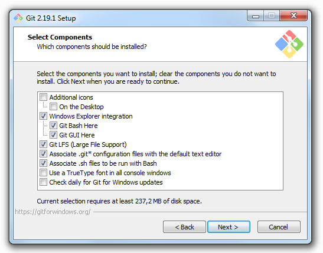
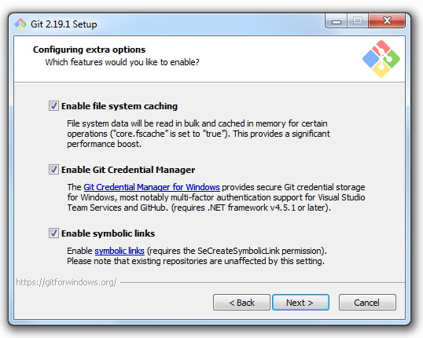

.. _user_installation_guide_source_code:

Get the Source Code
===================

.. important:: If you do not plan to modify the |AFF3CT| source code and you
               want to use the simulator/library as is, you can **download one
               of the latest builds** from the
               `download page of the AFF3CT website <http://aff3ct.github.io/download.html>`_
               and skip this section.

.. _Git: https://en.wikipedia.org/wiki/Git
.. _GitHub: https://github.com/
.. _AFF3CT repository: https://github.com/aff3ct/aff3ct

This project uses `Git`_ as the version-control system to manage the source
code. The |AFF3CT| repository is hosted on `GitHub`_. To get the source code,
first install the Git software and secondly `clone` the
`AFF3CT repository`_ locally.

Git Installation
----------------

.. _source_code-git_installation-windows:

Windows/macOS
^^^^^^^^^^^^^

`Download Git from the official web page <https://git-scm.com/downloads>`_
and launch the install. Just press the `Next` button until the
installation is over.

.. warning:: On Windows, Git comes with the **Git Bash** terminal which is,
             to our mind, better suitable that the traditional **Windows
             Console**. We encourage you to use **Git Bash** instead of the
             **Windows Command Prompt** for the following steps.

.. warning:: It is recommended to add Git to your system PATH during the
             installation.

.. image:: images/git_path.png
   :align: center

.. note:: On Windows, during the installation you may want to check the **Linux
          symbolic links** support.

Linux
^^^^^

Install Git from the package manager:

.. code-block:: console

   sudo apt install git

.. note:: On CentOS-like systems you have to replace ``apt`` by ``yum``.

Clone |AFF3CT| from GitHub
--------------------------

Get the source code from GitHub:

.. code-block:: console

   git clone --recursive https://github.com/aff3ct/aff3ct.git
   cd aff3ct

.. _Git submodule feature: https://git-scm.com/docs/git-submodule

The |AFF3CT| repository contains some dependencies to other repositories.
Technically those dependencies are managed by the `Git submodule feature`_.
By default the submodules are not downloaded during the ``git clone`` process
this is why the ``--recursive`` option has been added.

.. danger:: On the `AFF3CT repository`_ you may want to directly download
            the source code without making a ``git clone``. This will get you an
            archive without the |AFF3CT| dependencies and the build process will
            fail. **Do not directly download AFF3CT from GitHub and please
            make a clone!**

If you want to manually get or update the |AFF3CT| submodules, you can use the
following command:

.. code-block:: console

   git submodule update --init --recursive

.. warning:: When ``git pull`` is used to get the last commits from the
             repository, the submodules are not automatically updated and it
             is required to call the previous ``git submodule`` command.