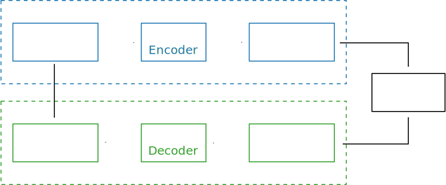

.. _user_library:

****************
Library Examples
****************

All the following examples simulate a basic communication chain with a |BPSK|
modem and a repetition code over an |AWGN| channel. The |BFER| results are
calculated from 0.0 dB to 10.0 dB with a 1.0 dB step.

.. _fig_simple_chain:

   Simulated communication chain.

.. note:: All the following examples of code are available in a dedicated
  GitHub repository: https://github.com/aff3ct/my_project_with_aff3ct. Sometime
  the full source codes in the repository may slighly differ from the ones
  on this page, but the philosophy remains the same.

.. _user_library_bootstrap:

Bootstrap
=========

The bootstrap example is the easiest way to start using the |AFF3CT| library. It is based on
``C++`` classes and methods that operate on buffers.
Keep in mind that this is the simplest way to use |AFF3CT|, but not the
most powerful way. More advanced features such as benchmarking, debugging, command line
interfacing, and more are illustrated in the :ref:`user_library_tasks` and
:ref:`user_library_factory` examples.

.. _fig_simple_chain_code:

.. figure:: images/simple_chain_code.svg
   :align: center

   Simulated communication chain: classes and methods.

:numref:`fig_simple_chain_code` illustrates the source code: green boxes
correspond to classes, blue boxes correspond to methods, and arrows represent buffers.

.. code-block:: cpp
	:caption: Bootstrap: main function
	:name: lst_bootstrap_main
	:linenos:
	:emphasize-lines: 6-9,15,31-40

	#include <aff3ct.hpp>
	using namespace aff3ct;

	int main(int argc, char** argv)
	{
		params1 p;  init_params1 (p   ); // create and initialize the parameters defined by the user
		modules1 m; init_modules1(p, m); // create and initialize modules
		buffers1 b; init_buffers1(p, b); // create and initialize the buffers required by the modules
		utils1 u;   init_utils1  (m, u); // create and initialize utils

		// display the legend in the terminal
		u.terminal->legend();

		// loop over SNRs range
		for (auto ebn0 = p.ebn0_min; ebn0 < p.ebn0_max; ebn0 += p.ebn0_step)
		{
			// compute the current sigma for the channel noise
			const auto esn0  = tools::ebn0_to_esn0 (ebn0, p.R);
			const auto sigma = tools::esn0_to_sigma(esn0     );

			u.noise->set_noise(sigma, ebn0, esn0);

			// update the sigma of the modem and the channel
			m.modem  ->set_noise(*u.noise);
			m.channel->set_noise(*u.noise);

			// display the performance (BER and FER) in real time (in a separate thread)
			u.terminal->start_temp_report();

			// run the simulation chain
			while (!m.monitor->fe_limit_achieved())
			{
				m.source ->generate    (                 b.ref_bits     );
				m.encoder->encode      (b.ref_bits,      b.enc_bits     );
				m.modem  ->modulate    (b.enc_bits,      b.symbols      );
				m.channel->add_noise   (b.symbols,       b.noisy_symbols);
				m.modem  ->demodulate  (b.noisy_symbols, b.LLRs         );
				m.decoder->decode_siho (b.LLRs,          b.dec_bits     );
				m.monitor->check_errors(b.dec_bits,      b.ref_bits     );
			}

			// display the performance (BER and FER) in the terminal
			u.terminal->final_report();

			// reset the monitor for the next SNR
			m.monitor->reset();
			u.terminal->reset();
		}

		return 0;
	}

:numref:`lst_bootstrap_main` gives an overview of what can be achieved with
the |AFF3CT| library. The firsts lines ``6-9`` are dedicated to the objects
instantiations and buffers allocation through dedicated structures. ``p``
contains the simulation parameters, ``b`` contains the buffers required by
the modules, ``m`` contains the modules of the communication chain and ``u`` is
a set of convenient helper objects.

Line ``15`` loops over the desired |SNRs| range. Lines ``31-40``, the ``while``
loop iterates until 100 frame errors have been detected by the monitor. The |AFF3CT|
communication chain methods are called inside this loop. Each |AFF3CT| method
works on input(s) and/or output(s) buffer(s) that have been declared at line ``8``.
Those buffers can be ``std::vector``, or pointers to user-allocated memory areas. The sizes and the types of
those buffers have to be set in accordance with the corresponding sizes and types of the |AFF3CT|
modules declared at line ``7``. If there is a size and/or type mismatch,
the |AFF3CT| library throws an exception. The |AFF3CT| modules are classes
that uses the C++ meta-programming technique (e.g. ``C++ templates``). By default
those templates are instantiated to ``int32_t`` or ``float``.

.. code-block:: cpp
	:caption: Bootstrap: parameters
	:name: lst_bootstrap_params
	:linenos:

	struct params1
	{
		int   K         =  32;     // number of information bits
		int   N         = 128;     // codeword size
		int   fe        = 100;     // number of frame errors
		int   seed      =   0;     // PRNG seed for the AWGN channel
		float ebn0_min  =   0.00f; // minimum SNR value
		float ebn0_max  =  10.01f; // maximum SNR value
		float ebn0_step =   1.00f; // SNR step
		float R;                   // code rate (R=K/N)
	};

	void init_params1(params1 &p)
	{
		p.R = (float)p.K / (float)p.N;
	}

:numref:`lst_bootstrap_params` describes the ``params1`` simulation
structure and the ``init_params1`` function used at line ``6`` in
:numref:`lst_bootstrap_main`.

.. code-block:: cpp
	:caption: Bootstrap: modules
	:name: lst_bootstrap_modules
	:linenos:

	struct modules1
	{
		std::unique_ptr<module::Source_random<>>          source;
		std::unique_ptr<module::Encoder_repetition_sys<>> encoder;
		std::unique_ptr<module::Modem_BPSK<>>             modem;
		std::unique_ptr<module::Channel_AWGN_LLR<>>       channel;
		std::unique_ptr<module::Decoder_repetition_std<>> decoder;
		std::unique_ptr<module::Monitor_BFER<>>           monitor;
	};

	void init_modules1(const params1 &p, modules1 &m)
	{
		m.source  = std::unique_ptr<module::Source_random         <>>(new module::Source_random         <>(p.K        ));
		m.encoder = std::unique_ptr<module::Encoder_repetition_sys<>>(new module::Encoder_repetition_sys<>(p.K, p.N   ));
		m.modem   = std::unique_ptr<module::Modem_BPSK            <>>(new module::Modem_BPSK            <>(p.N        ));
		m.channel = std::unique_ptr<module::Channel_AWGN_LLR      <>>(new module::Channel_AWGN_LLR      <>(p.N, p.seed));
		m.decoder = std::unique_ptr<module::Decoder_repetition_std<>>(new module::Decoder_repetition_std<>(p.K, p.N   ));
		m.monitor = std::unique_ptr<module::Monitor_BFER          <>>(new module::Monitor_BFER          <>(p.K, p.fe  ));
	};

:numref:`lst_bootstrap_main` describes the ``modules1`` structure
and the ``init_modules1`` function used at line ``7`` in
:numref:`lst_bootstrap_main`. The ``init_modules1`` function allocates the
modules of the communication chain. Those modules are allocated on the heap and
managed by smart pointers (``std::unique_ptr``). Note that the ``init_modules1``
function takes a ``params1`` structure from :numref:`lst_bootstrap_params` in
parameter. These parameters are used to build the modules.

.. code-block:: cpp
	:caption: Bootstrap: buffers
	:name: lst_bootstrap_buffers
	:linenos:

	struct buffers1
	{
		std::vector<int  > ref_bits;
		std::vector<int  > enc_bits;
		std::vector<float> symbols;
		std::vector<float> noisy_symbols;
		std::vector<float> LLRs;
		std::vector<int  > dec_bits;
	};

	void init_buffers1(const params1 &p, buffers1 &b)
	{
		b.ref_bits      = std::vector<int  >(p.K);
		b.enc_bits      = std::vector<int  >(p.N);
		b.symbols       = std::vector<float>(p.N);
		b.noisy_symbols = std::vector<float>(p.N);
		b.LLRs          = std::vector<float>(p.N);
		b.dec_bits      = std::vector<int  >(p.K);
	}

:numref:`lst_bootstrap_buffers` describes the ``buffers1`` structure
and the ``init_buffers1`` function used at line ``8`` in
:numref:`lst_bootstrap_main`. The ``init_buffers1`` function allocates the
buffers of the communication chain. Here, we chose to allocate buffers as
instances of the ``std::vector`` C++ standard class. As for the modules in
:numref:`lst_bootstrap_modules`, the size of the buffers is obtained from the
``params1`` input structure (cf. :numref:`lst_bootstrap_params`).

.. code-block:: cpp
	:caption: Bootstrap: utils
	:name: lst_bootstrap_utils
	:linenos:

	struct utils1
	{
		std::unique_ptr<tools::Sigma<>>               noise;     // a sigma noise type
		std::vector<std::unique_ptr<tools::Reporter>> reporters; // list of reporters dispayed in the terminal
		std::unique_ptr<tools::Terminal_std>          terminal;  // manage the output text in the terminal
	};

	void init_utils1(const modules1 &m, utils1 &u)
	{
		// create a sigma noise type
		u.noise = std::unique_ptr<tools::Sigma<>>(new tools::Sigma<>());
		// report the noise values (Es/N0 and Eb/N0)
		u.reporters.push_back(std::unique_ptr<tools::Reporter>(new tools::Reporter_noise<>(*u.noise)));
		// report the bit/frame error rates
		u.reporters.push_back(std::unique_ptr<tools::Reporter>(new tools::Reporter_BFER<>(*m.monitor)));
		// report the simulation throughputs
		u.reporters.push_back(std::unique_ptr<tools::Reporter>(new tools::Reporter_throughput<>(*m.monitor)));
		// create a terminal that will display the collected data from the reporters
		u.terminal = std::unique_ptr<tools::Terminal_std>(new tools::Terminal_std(u.reporters));
	}

:numref:`lst_bootstrap_utils` describes the ``utils1`` structure and the
``init_utils1`` function used at line ``9`` in :numref:`lst_bootstrap_main`.
The ``init_utils1`` function allocates 1) the ``noise`` object that contains the
type of noise we want to simulate (e.g. `sigma`), 2) a ``terminal`` object that takes care of printing
the |BFER| to the console. Three reporters are
created, one for to print |SNR|, another one to print |BFER|, and the last
one to report the simulation throughput in the ``terminal``.

If you run the `bootstrap` example, the expected output is shown in
:numref:`lst_bootstrap_output`.

.. code-block:: bash
	:caption: Bootstrap: output
	:name: lst_bootstrap_output

	# ---------------------||------------------------------------------------------||---------------------
	#  Signal Noise Ratio  ||   Bit Error Rate (BER) and Frame Error Rate (FER)    ||  Global throughput
	#         (SNR)        ||                                                      ||  and elapsed time
	# ---------------------||------------------------------------------------------||---------------------
	# ----------|----------||----------|----------|----------|----------|----------||----------|----------
	#     Es/N0 |    Eb/N0 ||      FRA |       BE |       FE |      BER |      FER ||  SIM_THR |    ET/RT
	#      (dB) |     (dB) ||          |          |          |          |          ||   (Mb/s) | (hhmmss)
	# ----------|----------||----------|----------|----------|----------|----------||----------|----------
	      -6.02 |     0.00 ||      108 |      262 |      100 | 7.58e-02 | 9.26e-01 ||    2.382 | 00h00'00
	      -5.02 |     1.00 ||      125 |      214 |      100 | 5.35e-02 | 8.00e-01 ||    4.813 | 00h00'00
	      -4.02 |     2.00 ||      136 |      179 |      100 | 4.11e-02 | 7.35e-01 ||    3.804 | 00h00'00
	      -3.02 |     3.00 ||      210 |      135 |      100 | 2.01e-02 | 4.76e-01 ||    4.516 | 00h00'00
	      -2.02 |     4.00 ||      327 |      122 |      100 | 1.17e-02 | 3.06e-01 ||    5.157 | 00h00'00
	      -1.02 |     5.00 ||      555 |      112 |      100 | 6.31e-03 | 1.80e-01 ||    4.703 | 00h00'00
	      -0.02 |     6.00 ||     1619 |      108 |      100 | 2.08e-03 | 6.18e-02 ||    4.110 | 00h00'00
	       0.98 |     7.00 ||     4566 |      102 |      100 | 6.98e-04 | 2.19e-02 ||    4.974 | 00h00'00
	       1.98 |     8.00 ||    15998 |      100 |      100 | 1.95e-04 | 6.25e-03 ||    4.980 | 00h00'00
	       2.98 |     9.00 ||    93840 |      100 |      100 | 3.33e-05 | 1.07e-03 ||    5.418 | 00h00'00
	       3.98 |    10.00 ||   866433 |      100 |      100 | 3.61e-06 | 1.15e-04 ||    4.931 | 00h00'05

.. note:: The full source code is available here:
  https://github.com/aff3ct/my_project_with_aff3ct/blob/master/examples/bootstrap/src/main.cpp.

.. _user_library_tasks:

Tasks
=====

Some of the |AFF3CT| classes inherit from the ``Module`` abstract class.
Generally speaking, any class defining methods for a communication
chain is a ``Module``. Inside a module class, there can be many public methods; however,
only some of them are directly used in the communication chain. A method
usable in a chain is named a ``Task``. A ``Task`` is characterized by its
behavior and its data: the input and output data are declared via a collection
of ``Socket`` objects.

.. code-block:: cpp
	:linenos:
	:caption: Tasks: main function
	:name: lst_tasks_main
	:emphasize-lines: 7-8,14-22,43-49,60-61

	#include <aff3ct.hpp>
	using namespace aff3ct;

	int main(int argc, char** argv)
	{
		params1  p; init_params1 (p   ); // create and initialize the parameters defined by the user
		modules1 m; init_modules2(p, m); // create and initialize modules
		// the 'init_buffers1' function is not required anymore
		utils1   u; init_utils1  (m, u); // create and initialize the utils

		// display the legend in the terminal
		u.terminal->legend();

		// sockets binding (connect sockets of successive tasks in the chain: the output socket of a task fills the input socket of the next task in the chain)
		using namespace module;
		(*m.encoder)[enc::sck::encode      ::U_K ].bind((*m.source )[src::sck::generate   ::U_K ]);
		(*m.modem  )[mdm::sck::modulate    ::X_N1].bind((*m.encoder)[enc::sck::encode     ::X_N ]);
		(*m.channel)[chn::sck::add_noise   ::X_N ].bind((*m.modem  )[mdm::sck::modulate   ::X_N2]);
		(*m.modem  )[mdm::sck::demodulate  ::Y_N1].bind((*m.channel)[chn::sck::add_noise  ::Y_N ]);
		(*m.decoder)[dec::sck::decode_siho ::Y_N ].bind((*m.modem  )[mdm::sck::demodulate ::Y_N2]);
		(*m.monitor)[mnt::sck::check_errors::U   ].bind((*m.encoder)[enc::sck::encode     ::U_K ]);
		(*m.monitor)[mnt::sck::check_errors::V   ].bind((*m.decoder)[dec::sck::decode_siho::V_K ]);

		// loop over the range of SNRs
		for (auto ebn0 = p.ebn0_min; ebn0 < p.ebn0_max; ebn0 += p.ebn0_step)
		{
			// compute the current sigma for the channel noise
			const auto esn0  = tools::ebn0_to_esn0 (ebn0, p.R);
			const auto sigma = tools::esn0_to_sigma(esn0     );

			u.noise->set_noise(sigma, ebn0, esn0);

			// update the sigma of the modem and the channel
			m.modem  ->set_noise(*u.noise);
			m.channel->set_noise(*u.noise);

			// display the performance (BER and FER) in real time (in a separate thread)
			u.terminal->start_temp_report();

			// run the simulation chain
			while (!m.monitor->fe_limit_achieved())
			{
				(*m.source )[src::tsk::generate    ].exec();
				(*m.encoder)[enc::tsk::encode      ].exec();
				(*m.modem  )[mdm::tsk::modulate    ].exec();
				(*m.channel)[chn::tsk::add_noise   ].exec();
				(*m.modem  )[mdm::tsk::demodulate  ].exec();
				(*m.decoder)[dec::tsk::decode_siho ].exec();
				(*m.monitor)[mnt::tsk::check_errors].exec();
			}

			// display the performance (BER and FER) in the terminal
			u.terminal->final_report();

			// reset the monitor and the terminal for the next SNR
			m.monitor->reset();
			u.terminal->reset();
		}

		// display the statistics of the tasks (if enabled)
		tools::Stats::show({ m.source.get(), m.encoder.get(), m.modem.get(), m.channel.get(), m.decoder.get(), m.monitor.get() }, true);

		return 0;
	}

:numref:`lst_tasks_main` shows how the ``Module``, ``Task`` and
``Socket`` objects work together. Line ``7``, ``modules2`` differs slightly from the
previous ``modules1`` structure, and it is also the same for the ``init_modules2``
function. :numref:`lst_tasks_modules` details the changes.

Thanks to the use of ``Task`` and ``Socket`` objects, it is now possible to
skip the buffer allocation part (see line ``8``), which is handled transparently by these objects.
For that, the connections between the sockets of successive tasks in
the chain have to be established explicitly: this is the binding process shown at lines ``14-22``,
using the ``bind`` method. In return, to execute the tasks (lines ``43-49``), you now only
need to call the ``exec`` method, without any parameters.

Using the ``bind`` and ``exec`` methods bring new useful features
for debugging and benchmarking. In :numref:`lst_tasks_main`, some statistics
about tasks are collected and reported at lines ``60-61`` (see :ref:`sim-sim-stats` section
for more informations about the statistics output).

.. code-block:: cpp
	:linenos:
	:caption: Tasks: modules
	:name: lst_tasks_modules
	:emphasize-lines: 10-24

	void init_modules2(const params1 &p, modules1 &m)
	{
		m.source  = std::unique_ptr<module::Source_random         <>>(new module::Source_random         <>(p.K        ));
		m.encoder = std::unique_ptr<module::Encoder_repetition_sys<>>(new module::Encoder_repetition_sys<>(p.K, p.N   ));
		m.modem   = std::unique_ptr<module::Modem_BPSK            <>>(new module::Modem_BPSK            <>(p.N        ));
		m.channel = std::unique_ptr<module::Channel_AWGN_LLR      <>>(new module::Channel_AWGN_LLR      <>(p.N, p.seed));
		m.decoder = std::unique_ptr<module::Decoder_repetition_std<>>(new module::Decoder_repetition_std<>(p.K, p.N   ));
		m.monitor = std::unique_ptr<module::Monitor_BFER          <>>(new module::Monitor_BFER          <>(p.K, p.fe  ));

		// configuration of the module tasks
		std::vector<const module::Module*> modules_list = { m.source.get(), m.encoder.get(), m.modem.get(), m.channel.get(), m.decoder.get(), m.monitor.get() };
		for (auto& mod : modules_list)
			for (auto& tsk : mod->tasks)
			{
				tsk->set_autoalloc  (true ); // enable the automatic allocation of data buffers in the tasks
				tsk->set_autoexec   (false); // disable the auto execution mode of the tasks
				tsk->set_debug      (false); // disable the debug mode
				tsk->set_debug_limit(16   ); // display only the 16 first bits if the debug mode is enabled
				tsk->set_stats      (true ); // enable statistics collection

				// enable fast mode (= disable optional checks in the tasks) if there is no debug and stats modes
				if (!tsk->is_debug() && !tsk->is_stats())
					tsk->set_fast(true);
			}
	}

The beginning of the ``init_modules2`` function (:numref:`lst_tasks_modules`) is
the same as the ``init_module1`` function (:numref:`lst_bootstrap_modules`). At
lines ``10-24``, each ``Module`` is parsed to get its tasks, each ``Task`` is
configured to automatically allocate its outputs ``Socket`` memory (line ``15``)
and collect statistics on the ``Task`` execution (line ``19``). It is also possible
to print debug information by toggling boolean to ``true`` at line ``17``.

.. note:: The full source code is available here:
  https://github.com/aff3ct/my_project_with_aff3ct/blob/master/examples/tasks/src/main.cpp.

.. _user_library_systemc:

SystemC/TLM
===========

Alternatively, the AFF3CT modules support SystemC/TLM interfaces, 
:numref:`lst_systemc_main` highlights the modifications in the ``main`` function
to use standard TLM interfaces.

.. code-block:: cpp
	:caption: SystemC/TLM: main function
	:name: lst_systemc_main
	:emphasize-lines: 13-18,33-54,59-61,70-72
	:linenos:

	#include <aff3ct.hpp>
	using namespace aff3ct;

	int sc_main(int argc, char** argv)
	{
		params1  p; init_params1 (p   ); // create and initialize the parameters defined by the user
		modules1 m; init_modules2(p, m); // create and initialize modules
		utils1   u; init_utils1  (m, u); // create and initialize utils

		// display the legend in the terminal
		u.terminal->legend();

		// add a callback to the monitor to call the "sc_core::sc_stop()" function
		m.monitor->add_handler_check([&m, &u]() -> void
		{
			if (m.monitor->fe_limit_achieved())
				sc_core::sc_stop();
		});

		// loop over the SNRs range
		for (auto ebn0 = p.ebn0_min; ebn0 < p.ebn0_max; ebn0 += p.ebn0_step)
		{
			// compute the current sigma for the channel noise
			const auto esn0  = tools::ebn0_to_esn0 (ebn0, p.R);
			const auto sigma = tools::esn0_to_sigma(esn0     );

			u.noise->set_noise(sigma, ebn0, esn0);

			// update the sigma of the modem and the channel
			m.modem  ->set_noise(*u.noise);
			m.channel->set_noise(*u.noise);

			// create "sc_core::sc_module" instances for each task
			using namespace module;
			m.source ->sc.create_module(+src::tsk::generate    );
			m.encoder->sc.create_module(+enc::tsk::encode      );
			m.modem  ->sc.create_module(+mdm::tsk::modulate    );
			m.modem  ->sc.create_module(+mdm::tsk::demodulate  );
			m.channel->sc.create_module(+chn::tsk::add_noise   );
			m.decoder->sc.create_module(+dec::tsk::decode_siho );
			m.monitor->sc.create_module(+mnt::tsk::check_errors);

			// declare a SystemC duplicator to duplicate the source 'generate' task output
			tools::SC_Duplicator duplicator;

			// bind the sockets between the modules
			m.source ->sc[+src::tsk::generate   ].s_out[+src::sck::generate   ::U_K ](duplicator                            .s_in                               );
			duplicator                           .s_out1                             (m.monitor->sc[+mnt::tsk::check_errors].s_in[+mnt::sck::check_errors::U   ]);
			duplicator                           .s_out2                             (m.encoder->sc[+enc::tsk::encode      ].s_in[+enc::sck::encode      ::U_K ]);
			m.encoder->sc[+enc::tsk::encode     ].s_out[+enc::sck::encode     ::X_N ](m.modem  ->sc[+mdm::tsk::modulate    ].s_in[+mdm::sck::modulate    ::X_N1]);
			m.modem  ->sc[+mdm::tsk::modulate   ].s_out[+mdm::sck::modulate   ::X_N2](m.channel->sc[+chn::tsk::add_noise   ].s_in[+chn::sck::add_noise   ::X_N ]);
			m.channel->sc[+chn::tsk::add_noise  ].s_out[+chn::sck::add_noise  ::Y_N ](m.modem  ->sc[+mdm::tsk::demodulate  ].s_in[+mdm::sck::demodulate  ::Y_N1]);
			m.modem  ->sc[+mdm::tsk::demodulate ].s_out[+mdm::sck::demodulate ::Y_N2](m.decoder->sc[+dec::tsk::decode_siho ].s_in[+dec::sck::decode_siho ::Y_N ]);
			m.decoder->sc[+dec::tsk::decode_siho].s_out[+dec::sck::decode_siho::V_K ](m.monitor->sc[+mnt::tsk::check_errors].s_in[+mnt::sck::check_errors::V   ]);

			// display the performance (BER and FER) in real time (in a separate thread)
			u.terminal->start_temp_report();

			// start the SystemC simulation
			sc_core::sc_report_handler::set_actions(sc_core::SC_INFO, sc_core::SC_DO_NOTHING);
			sc_core::sc_start();

			// display the performance (BER and FER) in the terminal
			u.terminal->final_report();

			// reset the monitor and the terminal for the next SNR
			m.monitor->reset();
			u.terminal->reset();

			// dirty way to create a new SystemC simulation context
			sc_core::sc_curr_simcontext = new sc_core::sc_simcontext();
			sc_core::sc_default_global_context = sc_core::sc_curr_simcontext;
		}

		// display the statistics of the tasks (if enabled)
		tools::Stats::show({ m.source.get(), m.encoder.get(), m.modem.get(), m.channel.get(), m.decoder.get(), m.monitor.get() }, true);

		return 0;
	}

.. note:: The full source code is available here:
  https://github.com/aff3ct/my_project_with_aff3ct/blob/master/examples/systemc/src/main.cpp.

.. _user_library_factory:

Factory
=======

In the previous :ref:`user_library_bootstrap`, :ref:`user_library_tasks` and
:ref:`user_library_systemc` examples, the AFF3CT ``Module`` classes were built
statically in the source code. In the ``Factory`` example, ``factory``
classes are used instead, to build modules dynamically from command line
arguments.

.. code-block:: cpp
	:caption: Factory: main function
	:name: lst_factory_main
	:linenos:

	#include <aff3ct.hpp>
	using namespace aff3ct;

	int main(int argc, char** argv)
	{
		params3  p; init_params3 (argc, argv, p); // create and initialize the parameters from the command line with factories
		modules3 m; init_modules3(p, m         ); // create and initialize modules
		utils1   u; init_utils3  (p, m, u      ); // create and initialize utils

		// [...]

		// display the statistics of the tasks (if enabled)
		tools::Stats::show({ m.source.get(), m.modem.get(), m.channel.get(), m.monitor.get(), m.encoder, m.decoder }, true);

		return 0;
	}

The ``main`` function in :numref:`lst_factory_main` is almost unchanged from
the ``main`` function in :numref:`lst_tasks_main`.

.. code-block:: cpp
	:caption: Factory: parameters
	:name: lst_factory_params
	:emphasize-lines: 8-13,18-43
	:linenos:

	struct params3
	{
		float ebn0_min  =  0.00f; // minimum SNR value
		float ebn0_max  = 10.01f; // maximum SNR value
		float ebn0_step =  1.00f; // SNR step
		float R;                  // code rate (R=K/N)

		std::unique_ptr<factory::Source          ::parameters> source;
		std::unique_ptr<factory::Codec_repetition::parameters> codec;
		std::unique_ptr<factory::Modem           ::parameters> modem;
		std::unique_ptr<factory::Channel         ::parameters> channel;
		std::unique_ptr<factory::Monitor_BFER    ::parameters> monitor;
		std::unique_ptr<factory::Terminal        ::parameters> terminal;
	};

	void init_params3(int argc, char** argv, params3 &p)
	{
		p.source   = std::unique_ptr<factory::Source          ::parameters>(new factory::Source          ::parameters());
		p.codec    = std::unique_ptr<factory::Codec_repetition::parameters>(new factory::Codec_repetition::parameters());
		p.modem    = std::unique_ptr<factory::Modem           ::parameters>(new factory::Modem           ::parameters());
		p.channel  = std::unique_ptr<factory::Channel         ::parameters>(new factory::Channel         ::parameters());
		p.monitor  = std::unique_ptr<factory::Monitor_BFER    ::parameters>(new factory::Monitor_BFER    ::parameters());
		p.terminal = std::unique_ptr<factory::Terminal        ::parameters>(new factory::Terminal        ::parameters());

		std::vector<factory::Factory::parameters*> params_list = { p.source .get(), p.codec  .get(), p.modem   .get(),
		                                                           p.channel.get(), p.monitor.get(), p.terminal.get() };

		// parse command line arguments for the given parameters and fill them
		factory::Command_parser cp(argc, argv, params_list, true);
		if (cp.parsing_failed())
		{
			cp.print_help    ();
			cp.print_warnings();
			cp.print_errors  ();
			std::exit(1);
		}

		std::cout << "# Simulation parameters: " << std::endl;
		factory::Header::print_parameters(params_list); // display the headers (= print the AFF3CT parameters on the screen)
		std::cout << "#" << std::endl;
		cp.print_warnings();

		p.R = (float)p.codec->enc->K / (float)p.codec->enc->N_cw; // compute the code rate
	}

The ``params3`` structure from :numref:`lst_factory_params` contains some
pointers to factory objects (lines ``8-13``). |SNR| parameters
remain static is this examples.

The ``init_params3`` function takes two new input arguments from the command
line: ``argc`` and ``argv``. The function first allocates the factories (lines
``18-23``) and then those factories are supplied with parameters from the command line
(line ``29``) thanks to the ``Command_parser`` class. Lines ``38-41``, the parameters
from the factories are printed to the terminal.

Note that in this example a repetition code is used, however it is very easy to
select another code type, for instance by replacing ``repetition`` line ``9`` and line ``19`` by
``polar`` to work with polar code.

.. code-block:: cpp
	:caption: Factory: modules
	:name: lst_factory_modules
	:emphasize-lines: 4,8-9,14-20
	:linenos:

	struct modules3
	{
		std::unique_ptr<module::Source<>>       source;
		std::unique_ptr<module::Codec_SIHO<>>   codec;
		std::unique_ptr<module::Modem<>>        modem;
		std::unique_ptr<module::Channel<>>      channel;
		std::unique_ptr<module::Monitor_BFER<>> monitor;
		                module::Encoder<>*      encoder;
		                module::Decoder_SIHO<>* decoder;
	};

	void init_modules3(const params3 &p, modules3 &m)
	{
		m.source  = std::unique_ptr<module::Source      <>>(p.source ->build());
		m.codec   = std::unique_ptr<module::Codec_SIHO  <>>(p.codec  ->build());
		m.modem   = std::unique_ptr<module::Modem       <>>(p.modem  ->build());
		m.channel = std::unique_ptr<module::Channel     <>>(p.channel->build());
		m.monitor = std::unique_ptr<module::Monitor_BFER<>>(p.monitor->build());
		m.encoder = m.codec->get_encoder().get();
		m.decoder = m.codec->get_decoder_siho().get();

		// configuration of the module tasks
		std::vector<const module::Module*> modules_list = { m.source.get(), m.modem.get(), m.channel.get(), m.monitor.get(), m.encoder, m.decoder };
		for (auto& mod : modules_list)
			for (auto& tsk : mod->tasks)
			{
				tsk->set_autoalloc  (true ); // enable the automatic allocation of the data in the tasks
				tsk->set_autoexec   (false); // disable the auto execution mode of the tasks
				tsk->set_debug      (false); // disable the debug mode
				tsk->set_debug_limit(16   ); // display only the 16 first bits if the debug mode is enabled
				tsk->set_stats      (true ); // enable the statistics

				// enable the fast mode (= disable the useless verifs in the tasks) if there is no debug and stats modes
				if (!tsk->is_debug() && !tsk->is_stats())
					tsk->set_fast(true);
			}
	}

In :numref:`lst_factory_modules` the ``modules3`` structure changes a little
bit because a ``Codec`` class is used to aggregate the ``Encoder`` and the
``Decoder`` together. In the ``init_modules3`` the factories allocated in
:numref:`lst_factory_params` are used to build the modules (lines ``14-18``).

.. code-block:: cpp
	:caption: Factory: utils
	:name: lst_factory_utils
	:emphasize-lines: 12
	:linenos:

	void init_utils3(const params3 &p, const modules3 &m, utils1 &u)
	{
		// create a sigma noise type
		u.noise = std::unique_ptr<tools::Sigma<>>(new tools::Sigma<>());
		// report noise values (Es/N0 and Eb/N0)
		u.reporters.push_back(std::unique_ptr<tools::Reporter>(new tools::Reporter_noise<>(*u.noise)));
		// report bit/frame error rates
		u.reporters.push_back(std::unique_ptr<tools::Reporter>(new tools::Reporter_BFER<>(*m.monitor)));
		// report simulation throughputs
		u.reporters.push_back(std::unique_ptr<tools::Reporter>(new tools::Reporter_throughput<>(*m.monitor)));
		// create a terminal object that will display the collected data from the reporters
		u.terminal = std::unique_ptr<tools::Terminal>(p.terminal->build(u.reporters));
	}

In the :numref:`lst_factory_utils`, the ``init_utils3`` changes a little bit
from the ``init_utils1`` function (:numref:`lst_bootstrap_utils`) because at
line ``12`` a factory is used to build the ``terminal``.

.. note:: The full source code is available here:
  https://github.com/aff3ct/my_project_with_aff3ct/blob/master/examples/factory/src/main.cpp.

.. _user_library_openmp:

OpenMP
======

.. _OpenMP: https://www.openmp.org/

In the previous examples the code is mono-threaded. To take advantage of the
today multi-core |CPUs| some modifications have to be made. This example
starts from the previous :ref:`user_library_factory` example and
adapts it to work on multi-threaded architectures using `pragma` directives of the well-known `OpenMP`
language.

.. code-block:: cpp
	:caption: OpenMP: main function
	:name: lst_openmp_main
	:emphasize-lines: 4,6,8,10-13,15,17-18,42,49,54,65-67,69-70,76,81
	:linenos:

	int main(int argc, char** argv)
	{
		params3 p; init_params3(argc, argv, p); // create and initialize the parameters from the command line with factories
		utils4 u; // create an 'utils4' structure

	#pragma omp parallel
	{
	#pragma omp single
	{
		// get the number of available threads from OpenMP
		const size_t n_threads = (size_t)omp_get_num_threads();
		u.monitors.resize(n_threads);
		u.modules .resize(n_threads);
	}
		modules4 m; init_modules_and_utils4(p, m, u); // create and initialize the modules and initialize a part of the utils

	#pragma omp barrier
	#pragma omp single
	{
		init_utils4(p, u); // finalize the utils initialization

		// display the legend in the terminal
		u.terminal->legend();
	}
		// sockets binding (connect the sockets of the tasks = fill the input sockets with the output sockets)
		using namespace module;
		(*m.encoder)[enc::sck::encode      ::U_K ].bind((*m.source )[src::sck::generate   ::U_K ]);
		(*m.modem  )[mdm::sck::modulate    ::X_N1].bind((*m.encoder)[enc::sck::encode     ::X_N ]);
		(*m.channel)[chn::sck::add_noise   ::X_N ].bind((*m.modem  )[mdm::sck::modulate   ::X_N2]);
		(*m.modem  )[mdm::sck::demodulate  ::Y_N1].bind((*m.channel)[chn::sck::add_noise  ::Y_N ]);
		(*m.decoder)[dec::sck::decode_siho ::Y_N ].bind((*m.modem  )[mdm::sck::demodulate ::Y_N2]);
		(*m.monitor)[mnt::sck::check_errors::U   ].bind((*m.encoder)[enc::sck::encode     ::U_K ]);
		(*m.monitor)[mnt::sck::check_errors::V   ].bind((*m.decoder)[dec::sck::decode_siho::V_K ]);

		// loop over the SNRs range
		for (auto ebn0 = p.ebn0_min; ebn0 < p.ebn0_max; ebn0 += p.ebn0_step)
		{
			// compute the current sigma for the channel noise
			const auto esn0  = tools::ebn0_to_esn0 (ebn0, p.R);
			const auto sigma = tools::esn0_to_sigma(esn0     );

	#pragma omp single
			u.noise->set_noise(sigma, ebn0, esn0);

			// update the sigma of the modem and the channel
			m.modem  ->set_noise(*u.noise);
			m.channel->set_noise(*u.noise);

	#pragma omp single
			// display the performance (BER and FER) in real time (in a separate thread)
			u.terminal->start_temp_report();

			// run the simulation chain
			while (!u.monitor_red->is_done_all())
			{
				(*m.source )[src::tsk::generate    ].exec();
				(*m.encoder)[enc::tsk::encode      ].exec();
				(*m.modem  )[mdm::tsk::modulate    ].exec();
				(*m.channel)[chn::tsk::add_noise   ].exec();
				(*m.modem  )[mdm::tsk::demodulate  ].exec();
				(*m.decoder)[dec::tsk::decode_siho ].exec();
				(*m.monitor)[mnt::tsk::check_errors].exec();
			}

	// need to wait all the threads here before to reset the 'monitors' and 'terminal' states
	#pragma omp barrier
	#pragma omp single
	{
			// final reduction
			u.monitor_red->is_done_all(true, true);

			// display the performance (BER and FER) in the terminal
			u.terminal->final_report();

			// reset the monitor and the terminal for the next SNR
			u.monitor_red->reset_all();
			u.terminal->reset();
	}
		}

	#pragma omp single
	{
		// display the statistics of the tasks (if enabled)
		tools::Stats::show(u.modules_stats, true);
	}
	}
		return 0;
	}

:numref:`lst_openmp_main` depicts how to use `OpenMP` pragmas to
parallelize the whole communication chain. As a remainder:

- ``#pragma omp parallel``: all the code after in the braces is executed by all
  the threads,
- ``#pragma omp barrier``: all the threads wait all the others at this point,
- ``#pragma omp single``: only one thread executes the code below (there is an
  implicit barrier at the end of the ``single`` zone).

In this example, a ``params3`` and an ``utils4`` structure are allocated in
``p`` and ``u`` respectively, before the parallel region (lines ``3-4``). As a
consequence, ``p`` and ``u`` are shared among all the threads. On the contrary,
a ``modules4`` structure is allocated in ``m`` inside the parallel region, thus
each threads gets its own local ``m``.

.. code-block:: cpp
	:caption: OpenMP: modules and utils
	:name: lst_openmp_modules_utils
	:emphasize-lines: 7,17-20,25-30,36-37,57
	:linenos:

	struct modules4
	{
		std::unique_ptr<module::Source<>>       source;
		std::unique_ptr<module::Codec_SIHO<>>   codec;
		std::unique_ptr<module::Modem<>>        modem;
		std::unique_ptr<module::Channel<>>      channel;
		                module::Monitor_BFER<>* monitor;
		                module::Encoder<>*      encoder;
		                module::Decoder_SIHO<>* decoder;
	};

	struct utils4
	{
		std::unique_ptr<tools::Sigma<>>                      noise;         // a sigma noise type
		std::vector<std::unique_ptr<tools::Reporter>>        reporters;     // list of reporters displayed in the terminal
		std::unique_ptr<tools::Terminal>                     terminal;      // manage the output text in the terminal
		std::vector<std::unique_ptr<module::Monitor_BFER<>>> monitors;      // list of the monitors from all the threads
		std::unique_ptr<module::Monitor_BFER_reduction>      monitor_red;   // main monitor object that reduce all the thread monitors
		std::vector<std::vector<const module::Module*>>      modules;       // list of the allocated modules
		std::vector<std::vector<const module::Module*>>      modules_stats; // list of the allocated modules reorganized for the statistics
	};

	void init_modules_and_utils4(const params3 &p, modules4 &m, utils4 &u)
	{
		// get the thread id from OpenMP
		const int tid = omp_get_thread_num();

		// set different seeds for different threads when the module use a PRNG
		p.source->seed += tid;
		p.channel->seed += tid;

		m.source        = std::unique_ptr<module::Source      <>>(p.source ->build());
		m.codec         = std::unique_ptr<module::Codec_SIHO  <>>(p.codec  ->build());
		m.modem         = std::unique_ptr<module::Modem       <>>(p.modem  ->build());
		m.channel       = std::unique_ptr<module::Channel     <>>(p.channel->build());
		u.monitors[tid] = std::unique_ptr<module::Monitor_BFER<>>(p.monitor->build());
		m.monitor       = u.monitors[tid].get();
		m.encoder       = m.codec->get_encoder().get();
		m.decoder       = m.codec->get_decoder_siho().get();

		// configuration of the module tasks
		std::vector<const module::Module*> modules_list = { m.source.get(), m.modem.get(), m.channel.get(), m.monitor, m.encoder, m.decoder };
		for (auto& mod : modules_list)
			for (auto& tsk : mod->tasks)
			{
				tsk->set_autoalloc  (true ); // enable the automatic allocation of the data in the tasks
				tsk->set_autoexec   (false); // disable the auto execution mode of the tasks
				tsk->set_debug      (false); // disable the debug mode
				tsk->set_debug_limit(16   ); // display only the 16 first bits if the debug mode is enabled
				tsk->set_stats      (true ); // enable the statistics

				// enable the fast mode (= disable the useless verifs in the tasks) if there is no debug and stats modes
				if (!tsk->is_debug() && !tsk->is_stats())
					tsk->set_fast(true);
			}

		u.modules[tid] = modules_list;
	}

In :numref:`lst_openmp_modules_utils`, there is a change in the
``modules4`` structure compared to the ``modules3`` structure
(:numref:`lst_factory_modules`): at line ``7`` the ``monitor`` is not
allocated in this structure anymore, thus a standard pointer is used instead of a smart
pointer. The monitor is now allocated in the ``utils4`` structure at line ``17``,
because all the monitors from all the threads have to be passed to build a
common aggregated monitor for all of them: the ``monitor_red`` at line ``18``.
``monitor_red`` is able to perform the reduction of all the per-thread ``monitors``.
In the example, the ``monitor_red`` is the only member from ``u`` called
by all the threads, to check whether the simulation has to continue or not (see line
``54`` in the ``main`` function, :numref:`lst_openmp_main`).

In the ``init_modules_and_utils4`` function, lines ``25-30``, a different seed
is assigned to the modules using a |PRNG|. It is important to give adistinct
seed to each thread. If the seed is the same for all threads, they
all simulate the same frame contents and apply the same noise over it.

Lines ``36-37``, the ``monitors`` are allocated in ``u`` and the resulting
pointer is assigned to ``m``. At line ``57`` a list of the modules is stored in
``u``.

.. code-block:: cpp
	:caption: OpenMP: utils
	:name: lst_openmp_utils
	:emphasize-lines: 3-5,17-20
	:linenos:

	void init_utils4(const params3 &p, utils4 &u)
	{
		// allocate a common monitor module to reduce all the monitors
		u.monitor_red = std::unique_ptr<module::Monitor_BFER_reduction>(new module::Monitor_BFER_reduction(u.monitors));
		u.monitor_red->set_reduce_frequency(std::chrono::milliseconds(500));
		// create a sigma noise type
		u.noise = std::unique_ptr<tools::Sigma<>>(new tools::Sigma<>());
		// report noise values (Es/N0 and Eb/N0)
		u.reporters.push_back(std::unique_ptr<tools::Reporter>(new tools::Reporter_noise<>(*u.noise)));
		// report bit/frame error rates
		u.reporters.push_back(std::unique_ptr<tools::Reporter>(new tools::Reporter_BFER<>(*u.monitor_red)));
		// report simulation throughputs
		u.reporters.push_back(std::unique_ptr<tools::Reporter>(new tools::Reporter_throughput<>(*u.monitor_red)));
		// create a terminal that will display the collected data from the reporters
		u.terminal = std::unique_ptr<tools::Terminal>(p.terminal->build(u.reporters));

		u.modules_stats.resize(u.modules[0].size());
		for (size_t m = 0; m < u.modules[0].size(); m++)
			for (size_t t = 0; t < u.modules.size(); t++)
				u.modules_stats[m].push_back(u.modules[t][m]);
	}

In :numref:`lst_openmp_utils`, the ``init_utils4`` function allocates and
configure the ``monitor_red`` at lines ``3-5``. Note that the allocation of
``monitor_red`` is possible because the ``monitors`` have been allocated
previously in the ``init_modules_and_utils4`` function
(:numref:`lst_openmp_modules_utils`).

Lines ``17-20``, the ``u.modules`` list is reordered in the ``u.modules_stats``
to be used for the statistics of the tasks in the ``main`` function
(:numref:`lst_openmp_main` line ``84``).

.. note:: The full source code is available here:
  https://github.com/aff3ct/my_project_with_aff3ct/blob/master/examples/openmp/src/main.cpp.
